# Social Media AI Agent System - Workflow Diagrams
## Complete Visual Architecture Documentation

---

## Agent Specification

**Agent Name**: Social Media AI Agent System

**Primary Purpose**: Analyze GitHub repositories and developer profiles, generate platform-optimized social media content, and automatically publish to LinkedIn, X (Twitter), and Instagram using autonomous AI agents.

**Inputs**:
- GitHub repository URL (required)
- GitHub profile URL (optional)
- Target platforms: List["linkedin", "twitter", "instagram"]
- Workflow configuration (API credentials, rate limits, feature flags)

**Outputs**:
- Repository analysis (stars, forks, tech stack, health score, recent activity)
- Profile insights (contributions, expertise areas, community engagement)
- Platform-specific content:
  - LinkedIn: 1300-1700 character professional post with 3-5 hashtags
  - Twitter: 200-280 character tweets or 3-5 tweet threads with 2-3 hashtags
  - Instagram: 500-1000 character caption with 10-20 hashtags
- Publishing results (post IDs, URLs, timestamps, success/failure status)

**External Dependencies**:
- **APIs**: GitHub REST/GraphQL API, OpenAI/Anthropic LLM API, LinkedIn Marketing API v2, X API v2, Instagram Graph API v21.0
- **Databases**: Redis (fast state access, rate limiting), SQLite (persistent checkpoints)
- **Services**: LangSmith (observability), LangGraph (workflow orchestration), CrewAI (agent coordination)

**Failure Conditions**:
- GitHub API authentication failure or repository not found
- Rate limit exceeded (LinkedIn: 100/hour, Twitter: 500/day, Instagram: 50/day)
- LLM API timeout or quota exceeded
- OAuth token expired (LinkedIn/Instagram: 60 days)
- Network timeout or connectivity issues
- Content validation failure (exceeds character limits)
- Publishing API errors (401, 403, 429, 500)
- State management lock acquisition timeout

**Success Criteria**:
- Repository data successfully fetched and analyzed
- Content generated within all platform constraints
- Posts published successfully to all requested platforms
- All checkpoints saved for fault tolerance
- Workflow status updated to "completed"
- Publishing results recorded with post IDs and URLs

---

## Workflow Description

The Social Media AI Agent System executes a multi-stage workflow:

1. **Initialization**: Accept workflow request, create unique workflow ID, initialize state with input parameters, save to Redis/SQLite
2. **GitHub Analysis Phase** (Parallel Execution):
   - Repository Analyzer Agent fetches repo metadata, languages, commits, calculates health score
   - Profile Insights Agent analyzes developer contributions, expertise, community activity
   - Both agents execute concurrently for efficiency
3. **Analysis Checkpoint**: Persist analysis results to database, save state snapshot for recovery
4. **Content Generation Phase** (Sequential with Planning):
   - Content Strategist Agent creates platform-specific strategies
   - LinkedIn Writer Agent generates professional post (1300-1700 chars)
   - Twitter Writer Agent creates tweet or thread (200-280 chars per tweet)
   - Instagram Writer Agent produces caption with hashtags (500-1000 chars)
   - Validate all content against platform constraints
5. **Generation Checkpoint**: Save generated content, update workflow state
6. **Publishing Phase** (Parallel Execution):
   - LinkedIn Publisher posts to LinkedIn API with retry logic
   - X Publisher posts to Twitter API with rate limit checks
   - Instagram Publisher creates media container and publishes
   - All publishers execute concurrently with exponential backoff retry
7. **Publishing Checkpoint**: Record results, save post IDs and URLs
8. **Completion**: Update workflow status, return final results to user

---

# 1. Flowchart Diagram

```mermaid
flowchart TD
    Start([Workflow Start]) --> Init[Initialize Workflow State<br/>- Generate workflow_id<br/>- Validate inputs<br/>- Set status = 'pending']
    
    Init --> SaveInit[(Save Initial State<br/>Redis + SQLite)]
    
    SaveInit --> AnalysisPhase{Start Analysis Phase}
    
    AnalysisPhase --> ParallelStart[[Parallel Execution]]
    
    ParallelStart --> RepoAnalyzer[Repository Analyzer Agent<br/>- Fetch repo metadata<br/>- Get languages<br/>- Analyze commits<br/>- Calculate health score]
    
    ParallelStart --> ProfileAnalyzer[Profile Insights Agent<br/>- Fetch contributions<br/>- Analyze expertise<br/>- Get activity patterns]
    
    RepoAnalyzer --> RepoCheck{Analysis<br/>Success?}
    ProfileAnalyzer --> ProfileCheck{Analysis<br/>Success?}
    
    RepoCheck -->|No| ErrorRepo[Add error to state<br/>status = 'failed']
    ProfileCheck -->|No| ErrorProfile[Add error to state<br/>status = 'failed']
    
    ErrorRepo --> ErrorHandler[Error Handler Node]
    ErrorProfile --> ErrorHandler
    
    RepoCheck -->|Yes| AnalysisComplete[Store repo_analysis in state]
    ProfileCheck -->|Yes| AnalysisComplete2[Store profile_insights in state]
    
    AnalysisComplete --> CheckBoth{Both analyses<br/>complete?}
    AnalysisComplete2 --> CheckBoth
    
    CheckBoth -->|No| WaitAnalysis[Wait for parallel completion]
    WaitAnalysis --> CheckBoth
    
    CheckBoth -->|Yes| Checkpoint1[(Checkpoint 1:<br/>Save Analysis State)]
    
    Checkpoint1 --> ContentPhase{Start Content Generation}
    
    ContentPhase --> Strategist[Content Strategist Agent<br/>- Create platform strategies<br/>- Define posting angles<br/>- Plan hashtags]
    
    Strategist --> StrategyCheck{Strategy<br/>Created?}
    
    StrategyCheck -->|No| ErrorStrategy[Add error to state]
    ErrorStrategy --> ErrorHandler
    
    StrategyCheck -->|Yes| Writers[[Sequential Writer Execution]]
    
    Writers --> LinkedInWriter[LinkedIn Writer Agent<br/>- Generate 1300-1700 chars<br/>- Professional tone<br/>- Add 3-5 hashtags]
    
    LinkedInWriter --> LinkedInValidate{Validate<br/>LinkedIn<br/>Content?}
    
    LinkedInValidate -->|Invalid| ErrorLinkedIn[Regenerate or fail]
    ErrorLinkedIn --> LinkedInWriter
    
    LinkedInValidate -->|Valid| TwitterWriter[Twitter Writer Agent<br/>- Generate tweet/thread<br/>- 200-280 chars each<br/>- Add 2-3 hashtags]
    
    TwitterWriter --> TwitterValidate{Validate<br/>Twitter<br/>Content?}
    
    TwitterValidate -->|Invalid| ErrorTwitter[Regenerate or fail]
    ErrorTwitter --> TwitterWriter
    
    TwitterValidate -->|Valid| InstagramWriter[Instagram Writer Agent<br/>- Generate caption<br/>- 500-1000 chars<br/>- Add 10-20 hashtags]
    
    InstagramWriter --> InstagramValidate{Validate<br/>Instagram<br/>Content?}
    
    InstagramValidate -->|Invalid| ErrorInstagram[Regenerate or fail]
    ErrorInstagram --> InstagramWriter
    
    InstagramValidate -->|Valid| Checkpoint2[(Checkpoint 2:<br/>Save Content State)]
    
    Checkpoint2 --> PublishPhase{Start Publishing Phase}
    
    PublishPhase --> CheckPlatforms{Check target<br/>platforms}
    
    CheckPlatforms --> ParallelPublish[[Parallel Publishing]]
    
    ParallelPublish --> LinkedInPub[LinkedIn Publisher<br/>- Check rate limit<br/>- Publish via API<br/>- Get post ID]
    
    ParallelPublish --> TwitterPub[Twitter Publisher<br/>- Check rate limit<br/>- Publish via API<br/>- Handle threads]
    
    ParallelPublish --> InstagramPub[Instagram Publisher<br/>- Check rate limit<br/>- Create container<br/>- Publish media]
    
    LinkedInPub --> LinkedInRetry{Publish<br/>Success?}
    TwitterPub --> TwitterRetry{Publish<br/>Success?}
    InstagramPub --> InstagramRetry{Publish<br/>Success?}
    
    LinkedInRetry -->|No| LinkedInRetryCheck{Retry<br/>count < 3?}
    TwitterRetry -->|No| TwitterRetryCheck{Retry<br/>count < 3?}
    InstagramRetry -->|No| InstagramRetryCheck{Retry<br/>count < 3?}
    
    LinkedInRetryCheck -->|Yes| LinkedInBackoff[Exponential backoff]
    TwitterRetryCheck -->|Yes| TwitterBackoff[Exponential backoff]
    InstagramRetryCheck -->|Yes| InstagramBackoff[Exponential backoff]
    
    LinkedInBackoff --> LinkedInPub
    TwitterBackoff --> TwitterPub
    InstagramBackoff --> InstagramPub
    
    LinkedInRetryCheck -->|No| LinkedInFail[Record failure in state]
    TwitterRetryCheck -->|No| TwitterFail[Record failure in state]
    InstagramRetryCheck -->|No| InstagramFail[Record failure in state]
    
    LinkedInRetry -->|Yes| LinkedInSuccess[Record post_id & URL]
    TwitterRetry -->|Yes| TwitterSuccess[Record post_id & URL]
    InstagramRetry -->|Yes| InstagramSuccess[Record post_id & URL]
    
    LinkedInSuccess --> CheckAllPublished{All platforms<br/>processed?}
    TwitterSuccess --> CheckAllPublished
    InstagramSuccess --> CheckAllPublished
    LinkedInFail --> CheckAllPublished
    TwitterFail --> CheckAllPublished
    InstagramFail --> CheckAllPublished
    
    CheckAllPublished -->|No| WaitPublish[Wait for completion]
    WaitPublish --> CheckAllPublished
    
    CheckAllPublished -->|Yes| Checkpoint3[(Checkpoint 3:<br/>Save Publishing State)]
    
    Checkpoint3 --> FinalCheck{Any critical<br/>failures?}
    
    FinalCheck -->|Yes| ErrorHandler
    
    FinalCheck -->|No| Complete[Set status = 'completed'<br/>Set completed_at timestamp]
    
    Complete --> SaveFinal[(Save Final State)]
    
    SaveFinal --> End([Workflow End:<br/>Return Results])
    
    ErrorHandler --> RecordError[(Save Error State)]
    RecordError --> ErrorEnd([Workflow End:<br/>Status: Failed])
    
    style Start fill:#90EE90
    style End fill:#90EE90
    style ErrorEnd fill:#FFB6C1
    style ErrorHandler fill:#FFB6C1
    style ParallelStart fill:#87CEEB
    style ParallelPublish fill:#87CEEB
    style Checkpoint1 fill:#FFD700
    style Checkpoint2 fill:#FFD700
    style Checkpoint3 fill:#FFD700
    style SaveInit fill:#FFD700
    style SaveFinal fill:#FFD700
    style RecordError fill:#FFD700
```

---

# 2. Sequence Diagram

```mermaid
sequenceDiagram
    participant User
    participant API as FastAPI Server
    participant WF as Workflow Engine<br/>(LangGraph)
    participant SM as State Manager<br/>(Redis/SQLite)
    participant RA as Repository<br/>Analyzer Agent
    participant PA as Profile<br/>Analyzer Agent
    participant GitHub as GitHub API
    participant CS as Content<br/>Strategist Agent
    participant LW as LinkedIn<br/>Writer Agent
    participant TW as Twitter<br/>Writer Agent
    participant IW as Instagram<br/>Writer Agent
    participant LLM as LLM API<br/>(GPT-4/Claude)
    participant LP as LinkedIn<br/>Publisher
    participant TP as Twitter<br/>Publisher
    participant IP as Instagram<br/>Publisher
    participant LinkedInAPI as LinkedIn API
    participant TwitterAPI as Twitter API
    participant InstagramAPI as Instagram API
    participant LS as LangSmith<br/>(Observability)
    
    User->>API: POST /workflows<br/>{repo_url, platforms}
    activate API
    
    API->>API: Generate workflow_id
    API->>SM: Save initial state
    activate SM
    SM-->>API: State saved
    deactivate SM
    
    API->>WF: Execute workflow_async(workflow_id)
    activate WF
    API-->>User: 202 Accepted<br/>{workflow_id, status: pending}
    deactivate API
    
    Note over WF,LS: PHASE 1: GitHub Analysis (Parallel)
    
    WF->>LS: Trace: Analysis phase started
    WF->>SM: Acquire distributed lock
    activate SM
    SM-->>WF: Lock acquired
    
    par Repository Analysis
        WF->>RA: Analyze repo_url
        activate RA
        RA->>GitHub: GET /repos/{owner}/{repo}
        activate GitHub
        GitHub-->>RA: Repo metadata
        RA->>GitHub: GET /repos/{owner}/{repo}/languages
        GitHub-->>RA: Language data
        RA->>GitHub: GET /repos/{owner}/{repo}/commits
        GitHub-->>RA: Recent commits
        deactivate GitHub
        RA->>RA: Calculate health score
        RA-->>WF: repo_analysis
        deactivate RA
    and Profile Analysis
        WF->>PA: Analyze profile_url
        activate PA
        PA->>GitHub: GraphQL: user contributions
        activate GitHub
        GitHub-->>PA: Contribution data
        PA->>GitHub: GET /users/{username}/events
        GitHub-->>PA: Activity events
        deactivate GitHub
        PA->>PA: Analyze expertise
        PA-->>WF: profile_insights
        deactivate PA
    end
    
    WF->>SM: Checkpoint 1: Save analysis
    SM-->>WF: Checkpoint saved
    deactivate SM
    WF->>LS: Trace: Analysis complete
    
    Note over WF,LS: PHASE 2: Content Generation (Sequential)
    
    WF->>CS: Create content strategy
    activate CS
    CS->>LLM: Generate platform strategy
    activate LLM
    LLM-->>CS: Strategy JSON
    deactivate LLM
    CS-->>WF: content_strategy
    deactivate CS
    
    WF->>LW: Generate LinkedIn post
    activate LW
    LW->>LLM: Prompt: Write LinkedIn post<br/>Context: {repo_analysis}
    activate LLM
    LLM-->>LW: Generated post (1456 chars)
    deactivate LLM
    LW->>LW: Validate character count
    alt Character count valid
        LW-->>WF: linkedin_post
    else Character count invalid
        LW->>LLM: Regenerate (shorter)
        activate LLM
        LLM-->>LW: Revised post
        deactivate LLM
        LW-->>WF: linkedin_post
    end
    deactivate LW
    
    WF->>TW: Generate Twitter content
    activate TW
    TW->>LLM: Prompt: Write tweet/thread
    activate LLM
    LLM-->>TW: Tweet(s)
    deactivate LLM
    TW->>TW: Validate length
    TW-->>WF: twitter_content
    deactivate TW
    
    WF->>IW: Generate Instagram caption
    activate IW
    IW->>LLM: Prompt: Write caption
    activate LLM
    LLM-->>IW: Caption with hashtags
    deactivate LLM
    IW->>IW: Validate format
    IW-->>WF: instagram_content
    deactivate IW
    
    WF->>SM: Checkpoint 2: Save content
    activate SM
    SM-->>WF: Checkpoint saved
    deactivate SM
    WF->>LS: Trace: Content generated
    
    Note over WF,LS: PHASE 3: Publishing (Parallel)
    
    par LinkedIn Publishing
        WF->>LP: Publish to LinkedIn
        activate LP
        LP->>SM: Check rate limit
        activate SM
        SM-->>LP: Rate OK (50/100 calls)
        deactivate SM
        LP->>LinkedInAPI: POST /ugcPosts
        activate LinkedInAPI
        alt Success
            LinkedInAPI-->>LP: 201 Created<br/>{id: "urn:li:share:123"}
            LP-->>WF: {success: true, post_id}
        else Rate Limit
            LinkedInAPI-->>LP: 429 Too Many Requests
            LP->>LP: Exponential backoff (2s)
            LP->>LinkedInAPI: Retry POST
            LinkedInAPI-->>LP: 201 Created
            LP-->>WF: {success: true, post_id}
        else Auth Error
            LinkedInAPI-->>LP: 401 Unauthorized
            LP-->>WF: {success: false, error}
        end
        deactivate LinkedInAPI
        deactivate LP
    and Twitter Publishing
        WF->>TP: Publish to Twitter
        activate TP
        TP->>SM: Check rate limit
        activate SM
        SM-->>TP: Rate OK (320/500 daily)
        deactivate SM
        TP->>TwitterAPI: POST /tweets
        activate TwitterAPI
        alt Success
            TwitterAPI-->>TP: {data: {id: "1234567890"}}
            TP-->>WF: {success: true, tweet_id}
        else Rate Limit
            TwitterAPI-->>TP: 429 Rate Limit
            TP->>TP: Wait 15 minutes
            TP->>TwitterAPI: Retry POST
            TwitterAPI-->>TP: Success
            TP-->>WF: {success: true, tweet_id}
        else API Error
            TwitterAPI-->>TP: 500 Internal Error
            TP->>TP: Retry 1 (4s wait)
            TP->>TwitterAPI: Retry POST
            TwitterAPI-->>TP: Success
            TP-->>WF: {success: true, tweet_id}
        end
        deactivate TwitterAPI
        deactivate TP
    and Instagram Publishing
        WF->>IP: Publish to Instagram
        activate IP
        IP->>SM: Check rate limit
        activate SM
        SM-->>IP: Rate OK (25/50 daily)
        deactivate SM
        IP->>InstagramAPI: POST /{account_id}/media<br/>(create container)
        activate InstagramAPI
        InstagramAPI-->>IP: {id: "container_123"}
        IP->>IP: Wait 5s for processing
        IP->>InstagramAPI: GET /{container_id}<br/>?fields=status_code
        InstagramAPI-->>IP: {status_code: "FINISHED"}
        IP->>InstagramAPI: POST /{account_id}/media_publish
        alt Success
            InstagramAPI-->>IP: {id: "post_456"}
            IP-->>WF: {success: true, post_id}
        else Container Error
            InstagramAPI-->>IP: {status_code: "ERROR"}
            IP-->>WF: {success: false, error}
        end
        deactivate InstagramAPI
        deactivate IP
    end
    
    WF->>SM: Checkpoint 3: Save results
    activate SM
    SM-->>WF: Final checkpoint saved
    SM->>SM: Release distributed lock
    deactivate SM
    
    WF->>LS: Trace: Workflow completed
    WF->>WF: Set status = 'completed'
    WF-->>API: Workflow result
    deactivate WF
    
    User->>API: GET /workflows/{workflow_id}
    activate API
    API->>SM: Get workflow state
    activate SM
    SM-->>API: Final state with results
    deactivate SM
    API-->>User: 200 OK<br/>{status: completed, results}
    deactivate API
```

---

# 3. Class Diagram

```mermaid
classDiagram
    class AgentState {
        +str workflow_id
        +str github_repo_url
        +str github_profile_url
        +List~str~ target_platforms
        +dict repo_analysis
        +dict profile_insights
        +dict content_strategy
        +dict linkedin_post
        +dict twitter_content
        +dict instagram_content
        +dict publish_results
        +str status
        +List~str~ errors
        +datetime created_at
        +datetime completed_at
        +str last_checkpoint
        +int retry_count
        +to_dict() dict
        +from_dict(data: dict) AgentState
        +validate() bool
    }
    
    class WorkflowEngine {
        -StateGraph graph
        -StateManager state_manager
        -SqliteSaver checkpointer
        -CompiledGraph app
        +__init__(state_manager: StateManager)
        +run(inputs: dict, config: dict) AgentState
        +ainvoke(initial_state: AgentState) AgentState
        -analyze_github_node(state: AgentState) AgentState
        -generate_content_node(state: AgentState) AgentState
        -publish_content_node(state: AgentState) AgentState
        -error_handler_node(state: AgentState) AgentState
        -should_continue_after_analysis(state: AgentState) str
        -should_continue_after_generation(state: AgentState) str
        -should_complete(state: AgentState) str
    }
    
    class StateManager {
        -str sqlite_path
        -Redis redis_client
        -aiosqlite.Connection db_connection
        +initialize() void
        +save_workflow_state(workflow_id: str, state: AgentState) void
        +get_workflow_state(workflow_id: str) AgentState
        +create_checkpoint(workflow_id: str, name: str, state: AgentState) void
        +restore_from_checkpoint(workflow_id: str, name: str) AgentState
        +distributed_lock(workflow_id: str, timeout: int) ContextManager
        +check_rate_limit(platform: str, user_id: str, limit: int) bool
    }
    
    class BaseAgent {
        <<abstract>>
        +str role
        +str goal
        +str backstory
        +List~Tool~ tools
        +bool verbose
        +str llm
        +execute(task: Task) Any
        +validate_output(output: Any) bool
    }
    
    class RepositoryAnalyzerAgent {
        +role = "GitHub Repository Analyst"
        +goal = "Extract insights from repositories"
        +tools = [github_api_tool]
        +analyze_repository(repo_url: str) dict
        -fetch_repo_metadata(owner: str, repo: str) dict
        -fetch_languages(owner: str, repo: str) dict
        -fetch_commits(owner: str, repo: str) List
        -calculate_health_score(repo_data: dict) float
    }
    
    class ProfileInsightsAgent {
        +role = "Developer Relations Specialist"
        +goal = "Understand developer profiles"
        +tools = [github_graphql_tool]
        +analyze_profile(profile_url: str) dict
        -fetch_contributions(username: str) dict
        -analyze_expertise(contributions: dict) List~str~
        -calculate_engagement_score(events: List) float
    }
    
    class ContentStrategistAgent {
        +role = "Multi-Platform Strategist"
        +goal = "Create platform strategies"
        +create_strategy(analysis: dict) dict
        -determine_content_angle(repo_data: dict) str
        -select_hashtags(platform: str, topics: List) List~str~
        -optimize_posting_time(platform: str) str
    }
    
    class LinkedInWriterAgent {
        +role = "Professional Technical Writer"
        +goal = "Craft LinkedIn posts"
        +tools = [llm_tool, validator_tool]
        +MAX_CHARS = 1700
        +MIN_CHARS = 1300
        +generate_post(context: dict) str
        -validate_length(post: str) bool
        -add_hashtags(post: str, tags: List) str
    }
    
    class TwitterWriterAgent {
        +role = "Tech Twitter Specialist"
        +goal = "Create engaging tweets"
        +tools = [llm_tool, thread_validator]
        +MAX_CHARS = 280
        +generate_tweet(context: dict) str
        +generate_thread(context: dict) List~str~
        -validate_tweet_length(tweet: str) bool
    }
    
    class InstagramWriterAgent {
        +role = "Visual Content Creator"
        +goal = "Write Instagram captions"
        +tools = [llm_tool, hashtag_optimizer]
        +MAX_CHARS = 2200
        +generate_caption(context: dict) str
        -optimize_hashtags(tags: List) List~str~
    }
    
    class BasePublisher {
        <<abstract>>
        +str platform_name
        +str access_token
        +int max_retries
        +int retry_backoff
        +publish(content: dict) PublishResult
        +retry_with_backoff(func: Callable) Any
        -check_rate_limit() bool
        -handle_api_error(error: Exception) void
    }
    
    class LinkedInPublisher {
        +platform_name = "LinkedIn"
        +str user_urn
        +str api_base = "https://api.linkedin.com/v2"
        +publish_post(text: str, media_url: str) PublishResult
        -upload_media(media_url: str) str
        -create_ugc_post(text: str, media_id: str) dict
    }
    
    class TwitterPublisher {
        +platform_name = "Twitter"
        +Client tweepy_client
        +API tweepy_api
        +publish_tweet(text: str, media: List) PublishResult
        +publish_thread(tweets: List~str~) PublishResult
        -upload_media(media_path: str) str
    }
    
    class InstagramPublisher {
        +platform_name = "Instagram"
        +str account_id
        +str graph_api = "https://graph.facebook.com/v21.0"
        +publish_image_post(image_url: str, caption: str) PublishResult
        +publish_carousel(media_urls: List, caption: str) PublishResult
        -create_media_container(image_url: str) str
        -wait_for_container_ready(container_id: str) bool
        -publish_container(container_id: str) dict
    }
    
    class PublishResult {
        +bool success
        +str platform
        +str post_id
        +str post_url
        +datetime published_at
        +str error_message
        +to_dict() dict
    }
    
    class Task {
        +str description
        +BaseAgent agent
        +str expected_output
        +List~Task~ context
        +bool async_execution
        +execute() Any
    }
    
    class Crew {
        +List~BaseAgent~ agents
        +List~Task~ tasks
        +Process process
        +bool verbose
        +bool memory
        +bool planning
        +kickoff(inputs: dict) Any
        +kickoff_async(inputs: dict) Any
    }
    
    class Tool {
        <<abstract>>
        +str name
        +str description
        +execute(*args, **kwargs) Any
    }
    
    class GitHubAPITool {
        +name = "github_api_tool"
        +str token
        +execute(endpoint: str, method: str) dict
    }
    
    class LLMTool {
        +name = "llm_tool"
        +str model
        +str api_key
        +execute(prompt: str, context: dict) str
    }
    
    class Settings {
        +str openai_api_key
        +str github_token
        +str linkedin_access_token
        +str twitter_api_key
        +str instagram_access_token
        +str redis_url
        +str sqlite_db_path
        +int max_retries
        +from_env() Settings
        +validate() bool
    }
    
    class RetryHandler {
        <<utility>>
        +with_retry(func: Callable, max_attempts: int) Any
        +exponential_backoff(attempt: int, base: int) int
        +safe_execute(func: Callable, fallback: Any) Any
    }
    
    class RateLimiter {
        +Redis redis_client
        +check_limit(key: str, limit: int, window: int) bool
        +increment(key: str) int
        +reset(key: str) void
    }
    
    %% Relationships
    WorkflowEngine --> AgentState : manages
    WorkflowEngine --> StateManager : uses
    WorkflowEngine --> Crew : orchestrates
    
    StateManager --> AgentState : persists
    StateManager --> RateLimiter : uses
    
    Crew --> BaseAgent : contains
    Crew --> Task : executes
    Task --> BaseAgent : assigned to
    
    BaseAgent <|-- RepositoryAnalyzerAgent : extends
    BaseAgent <|-- ProfileInsightsAgent : extends
    BaseAgent <|-- ContentStrategistAgent : extends
    BaseAgent <|-- LinkedInWriterAgent : extends
    BaseAgent <|-- TwitterWriterAgent : extends
    BaseAgent <|-- InstagramWriterAgent : extends
    
    BaseAgent --> Tool : uses
    Tool <|-- GitHubAPITool : implements
    Tool <|-- LLMTool : implements
    
    BasePublisher <|-- LinkedInPublisher : extends
    BasePublisher <|-- TwitterPublisher : extends
    BasePublisher <|-- InstagramPublisher : extends
    
    BasePublisher --> PublishResult : returns
    BasePublisher --> RetryHandler : uses
    BasePublisher --> RateLimiter : checks
    
    WorkflowEngine --> RepositoryAnalyzerAgent : invokes
    WorkflowEngine --> ProfileInsightsAgent : invokes
    WorkflowEngine --> ContentStrategistAgent : invokes
    WorkflowEngine --> LinkedInWriterAgent : invokes
    WorkflowEngine --> TwitterWriterAgent : invokes
    WorkflowEngine --> InstagramWriterAgent : invokes
    WorkflowEngine --> LinkedInPublisher : invokes
    WorkflowEngine --> TwitterPublisher : invokes
    WorkflowEngine --> InstagramPublisher : invokes
    
    Settings --> WorkflowEngine : configures
    Settings --> BasePublisher : configures
```

---

# 4. State Diagram

```mermaid
stateDiagram-v2
    [*] --> Idle: System Ready
    
    Idle --> Initializing: Receive Workflow Request
    
    state Initializing {
        [*] --> ValidatingInputs
        ValidatingInputs --> CreatingWorkflowID: Valid
        ValidatingInputs --> [*]: Invalid Inputs
        CreatingWorkflowID --> SavingInitialState
        SavingInitialState --> [*]: Initialization Complete
    }
    
    Initializing --> Analyzing: Initialization Success
    Initializing --> Error: Initialization Failed
    
    state Analyzing {
        [*] --> AcquiringLock
        AcquiringLock --> LockAcquired
        AcquiringLock --> LockTimeout: Timeout
        
        LockAcquired --> AnalyzingRepo: Start Analysis
        LockAcquired --> AnalyzingProfile: Start Analysis
        
        state AnalyzingRepo {
            [*] --> FetchingRepoMetadata
            FetchingRepoMetadata --> FetchingLanguages: Success
            FetchingRepoMetadata --> RetryRepo: API Error
            RetryRepo --> FetchingRepoMetadata: Retry < 3
            RetryRepo --> AnalysisFailed: Max Retries
            FetchingLanguages --> FetchingCommits: Success
            FetchingCommits --> CalculatingHealthScore: Success
            CalculatingHealthScore --> [*]: Repo Analysis Complete
        }
        
        state AnalyzingProfile {
            [*] --> FetchingContributions
            FetchingContributions --> FetchingActivity: Success
            FetchingContributions --> RetryProfile: API Error
            RetryProfile --> FetchingContributions: Retry < 3
            RetryProfile --> AnalysisFailed: Max Retries
            FetchingActivity --> AnalyzingExpertise: Success
            AnalyzingExpertise --> [*]: Profile Analysis Complete
        }
        
        AnalyzingRepo --> CheckingCompletion
        AnalyzingProfile --> CheckingCompletion
        CheckingCompletion --> SavingCheckpoint1: Both Complete
        SavingCheckpoint1 --> [*]: Analysis Phase Done
        
        LockTimeout --> [*]: Lock Failure
        AnalysisFailed --> [*]: Analysis Error
    }
    
    Analyzing --> Generating: Analysis Success
    Analyzing --> Error: Analysis Failed
    
    state Generating {
        [*] --> CreatingStrategy
        CreatingStrategy --> StrategyCreated: LLM Success
        CreatingStrategy --> RetryStrategy: LLM Error
        RetryStrategy --> CreatingStrategy: Retry < 3
        RetryStrategy --> GenerationFailed: Max Retries
        
        StrategyCreated --> GeneratingLinkedIn
        
        state GeneratingLinkedIn {
            [*] --> CallingLLM_LinkedIn
            CallingLLM_LinkedIn --> ValidatingLength: Content Generated
            CallingLLM_LinkedIn --> RetryLLM: API Timeout
            RetryLLM --> CallingLLM_LinkedIn: Retry
            ValidatingLength --> ValidatingFormat: Valid (1300-1700)
            ValidatingLength --> RegenerateLinkedIn: Invalid Length
            RegenerateLinkedIn --> CallingLLM_LinkedIn
            ValidatingFormat --> [*]: LinkedIn Post Ready
        }
        
        GeneratingLinkedIn --> GeneratingTwitter: LinkedIn Complete
        
        state GeneratingTwitter {
            [*] --> CallingLLM_Twitter
            CallingLLM_Twitter --> ValidatingTweetLength: Content Generated
            ValidatingTweetLength --> ValidatingThreadStructure: Valid (< 280)
            ValidatingTweetLength --> RegenerateTwitter: Invalid
            RegenerateTwitter --> CallingLLM_Twitter
            ValidatingThreadStructure --> [*]: Twitter Content Ready
        }
        
        GeneratingTwitter --> GeneratingInstagram: Twitter Complete
        
        state GeneratingInstagram {
            [*] --> CallingLLM_Instagram
            CallingLLM_Instagram --> ValidatingCaptionLength: Content Generated
            ValidatingCaptionLength --> OptimizingHashtags: Valid
            ValidatingCaptionLength --> RegenerateInstagram: Invalid
            RegenerateInstagram --> CallingLLM_Instagram
            OptimizingHashtags --> [*]: Instagram Caption Ready
        }
        
        GeneratingInstagram --> SavingCheckpoint2: All Content Generated
        SavingCheckpoint2 --> [*]: Generation Phase Done
        
        GenerationFailed --> [*]: Generation Error
    }
    
    Generating --> Publishing: Generation Success
    Generating --> Error: Generation Failed
    
    state Publishing {
        [*] --> CheckingPlatforms
        CheckingPlatforms --> PublishingLinkedIn
        CheckingPlatforms --> PublishingTwitter
        CheckingPlatforms --> PublishingInstagram
        
        state PublishingLinkedIn {
            [*] --> CheckingLinkedInRate
            CheckingLinkedInRate --> RateLimitOK_LI: Under Limit
            CheckingLinkedInRate --> WaitingRateLimit_LI: Over Limit
            WaitingRateLimit_LI --> CheckingLinkedInRate: After Wait
            
            RateLimitOK_LI --> CallingLinkedInAPI
            CallingLinkedInAPI --> LinkedInPublished: 201 Created
            CallingLinkedInAPI --> RetryLinkedIn: 429/500 Error
            CallingLinkedInAPI --> LinkedInAuthError: 401 Error
            
            RetryLinkedIn --> BackoffLinkedIn: Retry < 3
            BackoffLinkedIn --> CallingLinkedInAPI: After Backoff
            RetryLinkedIn --> LinkedInFailed: Max Retries
            
            LinkedInPublished --> RecordingLinkedInResult
            LinkedInFailed --> RecordingLinkedInResult
            LinkedInAuthError --> RecordingLinkedInResult
            RecordingLinkedInResult --> [*]: LinkedIn Done
        }
        
        state PublishingTwitter {
            [*] --> CheckingTwitterRate
            CheckingTwitterRate --> RateLimitOK_TW: Under Limit
            CheckingTwitterRate --> WaitingRateLimit_TW: Over Limit
            WaitingRateLimit_TW --> CheckingTwitterRate: After 15min
            
            RateLimitOK_TW --> CallingTwitterAPI
            CallingTwitterAPI --> TwitterPublished: Success
            CallingTwitterAPI --> RetryTwitter: Error
            
            RetryTwitter --> BackoffTwitter: Retry < 3
            BackoffTwitter --> CallingTwitterAPI: After Backoff
            RetryTwitter --> TwitterFailed: Max Retries
            
            TwitterPublished --> RecordingTwitterResult
            TwitterFailed --> RecordingTwitterResult
            RecordingTwitterResult --> [*]: Twitter Done
        }
        
        state PublishingInstagram {
            [*] --> CheckingInstagramRate
            CheckingInstagramRate --> RateLimitOK_IG: Under Limit
            CheckingInstagramRate --> WaitingRateLimit_IG: Over Limit
            WaitingRateLimit_IG --> CheckingInstagramRate: After Wait
            
            RateLimitOK_IG --> CreatingMediaContainer
            CreatingMediaContainer --> ContainerCreated: Success
            CreatingMediaContainer --> RetryContainer: Error
            RetryContainer --> CreatingMediaContainer: Retry < 3
            
            ContainerCreated --> WaitingForProcessing
            WaitingForProcessing --> CheckingContainerStatus
            CheckingContainerStatus --> PublishingContainer: FINISHED
            CheckingContainerStatus --> WaitingForProcessing: IN_PROGRESS
            CheckingContainerStatus --> InstagramFailed: ERROR/TIMEOUT
            
            PublishingContainer --> InstagramPublished: Success
            PublishingContainer --> RetryPublish: Error
            RetryPublish --> PublishingContainer: Retry < 3
            RetryPublish --> InstagramFailed: Max Retries
            
            InstagramPublished --> RecordingInstagramResult
            InstagramFailed --> RecordingInstagramResult
            RecordingInstagramResult --> [*]: Instagram Done
        }
        
        PublishingLinkedIn --> CheckingAllPlatforms
        PublishingTwitter --> CheckingAllPlatforms
        PublishingInstagram --> CheckingAllPlatforms
        
        CheckingAllPlatforms --> SavingCheckpoint3: All Processed
        SavingCheckpoint3 --> ReleasingLock
        ReleasingLock --> [*]: Publishing Phase Done
    }
    
    Publishing --> Completed: Publishing Success
    Publishing --> PartialSuccess: Some Platforms Failed
    Publishing --> Error: All Platforms Failed
    
    state Completed {
        [*] --> UpdatingStatus
        UpdatingStatus --> SettingTimestamp
        SettingTimestamp --> SavingFinalState
        SavingFinalState --> [*]: Workflow Complete
    }
    
    state PartialSuccess {
        [*] --> LoggingPartialFailures
        LoggingPartialFailures --> MarkingPartialComplete
        MarkingPartialComplete --> [*]: Partial Success
    }
    
    state Error {
        [*] --> DeterminingErrorType
        DeterminingErrorType --> RecoverableError: Can Retry
        DeterminingErrorType --> FatalError: Cannot Retry
        
        RecoverableError --> CheckingRetryCount
        CheckingRetryCount --> SchedulingRetry: Retries < Max
        CheckingRetryCount --> FatalError: Max Retries Exceeded
        
        SchedulingRetry --> WaitingForRetry
        WaitingForRetry --> RestoringFromCheckpoint: After Backoff
        
        FatalError --> LoggingError
        LoggingError --> SavingErrorState
        SavingErrorState --> [*]: Error Recorded
    }
    
    Completed --> Idle: Return Results
    PartialSuccess --> Idle: Return Partial Results
    Error --> Idle: Return Error
    
    RestoringFromCheckpoint --> Analyzing: Checkpoint analyze_complete
    RestoringFromCheckpoint --> Generating: Checkpoint generate_complete
    RestoringFromCheckpoint --> Publishing: Checkpoint publish_complete
    
    note right of Idle
        System awaiting new
        workflow requests
    end note
    
    note right of Analyzing
        Parallel execution:
        Repository & Profile
        analysis concurrent
    end note
    
    note right of Generating
        Sequential execution:
        Writers execute in order
        with planning coordination
    end note
    
    note right of Publishing
        Parallel execution:
        All platforms publish
        concurrently with retry
    end note
    
    note right of Error
        Checkpoint-based recovery
        allows resuming from
        last successful state
    end note
```

---

## Diagram Consistency Verification

All four diagrams represent the **exact same workflow logic**:

### Workflow Stages (Consistent Across All Diagrams):
1. **Initialization**: Create workflow ID, validate inputs, save initial state
2. **GitHub Analysis**: Parallel execution of Repository Analyzer + Profile Insights Agent
3. **Checkpoint 1**: Persist analysis results
4. **Content Generation**: Sequential execution (Strategy → LinkedIn → Twitter → Instagram writers)
5. **Checkpoint 2**: Persist generated content
6. **Publishing**: Parallel execution of platform publishers with retry logic
7. **Checkpoint 3**: Persist publishing results
8. **Completion**: Update final state, return results

### Key Elements (Present in All Diagrams):
- **Parallel Execution**: Analysis phase and Publishing phase both use concurrent processing
- **Sequential Planning**: Content generation executes writers in order with strategy coordination
- **Checkpointing**: Three checkpoints for fault tolerance and recovery
- **Retry Logic**: Exponential backoff for API errors with max 3 retries
- **Rate Limiting**: Check before each API call, wait if exceeded
- **Error Handling**: Separate error paths with recovery options
- **State Management**: Redis for fast access, SQLite for persistence
- **Lock Management**: Distributed locking for concurrent workflow protection

### Naming Consistency:
- States/Nodes: `Idle`, `Analyzing`, `Generating`, `Publishing`, `Completed`, `Error`
- Agents: `RepositoryAnalyzerAgent`, `ProfileInsightsAgent`, `ContentStrategistAgent`, `LinkedInWriterAgent`, `TwitterWriterAgent`, `InstagramWriterAgent`
- Publishers: `LinkedInPublisher`, `TwitterPublisher`, `InstagramPublisher`
- Checkpoints: `Checkpoint 1 (analyze_complete)`, `Checkpoint 2 (generate_complete)`, `Checkpoint 3 (publish_complete)`
- APIs: `GitHub API`, `LinkedIn API`, `Twitter API`, `Instagram API`, `LLM API`

### Failure Handling (Consistent):
- **Rate Limits**: Wait and retry (LinkedIn: hourly, Twitter: 15min windows, Instagram: daily)
- **API Errors**: Exponential backoff retry (2s, 4s, 8s, ..., max 60s)
- **Auth Failures**: Immediate failure, no retry (token refresh required)
- **Max Retries**: 3 attempts per operation
- **Checkpoint Recovery**: Resume from last successful checkpoint

All diagrams maintain complete logical equivalence while presenting different perspectives of the same autonomous agent workflow system.
