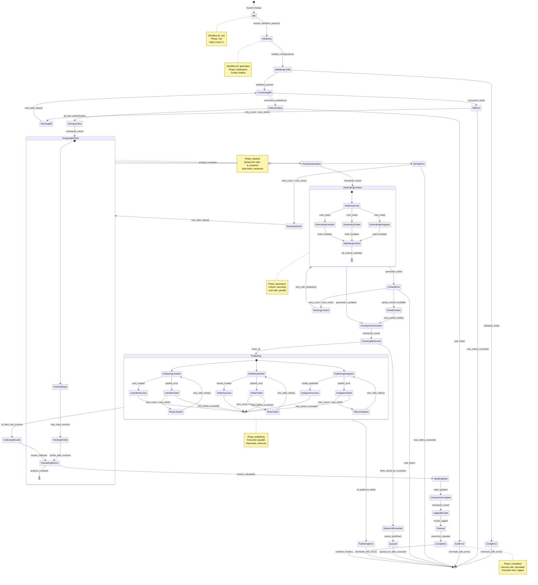

# Social Media AI Agent System - Workflow Diagrams

## Agent Specification

**Agent Name:** Social Media AI Agent System (Autonomous Multi-Platform Content Publishing System)

**Primary Purpose:** Analyze GitHub repositories and profiles, generate platform-optimized social media content, and automatically publish to LinkedIn, X (Twitter), and Instagram

**Inputs:**
- GitHub repository URL
- GitHub username
- Target platforms list (linkedin, twitter, instagram)
- Workflow configuration (max_retries, timeout, etc.)
- API credentials (from environment)

**Outputs:**
- GitHub analysis results (repository metadata, health score, tech stack, insights)
- Platform-optimized content drafts (LinkedIn posts, Twitter threads, Instagram captions)
- Published post IDs and status per platform
- Workflow execution metrics (success rate, duration, errors)
- Persisted state snapshots

**External Dependencies:**
- GitHub API (v3 REST API)
- LinkedIn API (v202501)
- X/Twitter API (v2)
- Instagram Graph API (v24.0)
- Anthropic Claude API (Sonnet 4)
- PostgreSQL database (state persistence)
- Redis (caching and rate limiting)
- LangSmith (observability/tracing)

**Failure Conditions:**
- API rate limits exceeded (GitHub: 5000/hr, LinkedIn: 100/day, X: 50/day, Instagram: 25/day)
- Invalid or expired OAuth tokens
- Network connectivity failures
- Database connection timeout
- LLM service unavailable or quota exceeded
- Content generation failures (validation errors)
- Publishing failures (platform API errors)
- Workflow timeout exceeded (>5 minutes)
- Maximum retry attempts exceeded (3 retries)

**Success Criteria:**
- GitHub analysis completed with health score generated
- Content generated and validated for all requested platforms
- At least one platform published successfully (90%+ target rate)
- All state transitions logged to database
- Execution time within SLA (<5 minutes end-to-end)
- No critical/blocking errors in workflow
- Checkpoints created at each phase boundary

---

## 1. FLOWCHART DIAGRAM

```mermaid
flowchart TD
    Start([Workflow Start]) --> Init[Initialize System<br/>- Validate Config<br/>- Setup DB Connections<br/>- Create Workflow ID]
    
    Init --> CheckConfig{Configuration<br/>Valid?}
    CheckConfig -->|No| ConfigError[Log Configuration Error]
    ConfigError --> ErrorEnd([End: Config Failed])
    
    CheckConfig -->|Yes| InitDB[Initialize Database<br/>- Connect PostgreSQL<br/>- Connect Redis<br/>- Setup Checkpointer]
    
    InitDB --> CheckDB{Database<br/>Connected?}
    CheckDB -->|No| DBRetry{Retry Count<br/>< Max?}
    DBRetry -->|Yes| InitDB
    DBRetry -->|No| DBError[Log Database Error]
    DBError --> ErrorEnd
    
    CheckDB -->|Yes| InitPublishers[Initialize Publishers<br/>- LinkedIn Client<br/>- X/Twitter Client<br/>- Instagram Client]
    
    InitPublishers --> CheckAuth{All APIs<br/>Authenticated?}
    CheckAuth -->|No| AuthError[Log Auth Error<br/>Check Tokens]
    AuthError --> ErrorEnd
    
    CheckAuth -->|Yes| SaveCheckpoint1[Save Checkpoint:<br/>Initialization Complete]
    
    SaveCheckpoint1 --> GitHubAnalysis[GitHub Analysis Phase<br/>- Fetch Repo Metadata<br/>- Analyze Code Structure<br/>- Fetch User Profile<br/>- Calculate Health Score]
    
    GitHubAnalysis --> CheckGitHub{Analysis<br/>Successful?}
    CheckGitHub -->|No| GitHubRetry{Retry Count<br/>< Max?}
    GitHubRetry -->|Yes| GitHubAnalysis
    GitHubRetry -->|No| GitHubError[Log GitHub Error<br/>Partial Results]
    GitHubError --> ErrorEnd
    
    CheckGitHub -->|Yes| SaveAnalysis[Save Analysis Results<br/>to Database]
    
    SaveAnalysis --> SaveCheckpoint2[Save Checkpoint:<br/>Analysis Complete]
    
    SaveCheckpoint2 --> ContentGen[Content Generation Phase<br/>- Initialize CrewAI Crew<br/>- Generate LinkedIn Post<br/>- Generate Twitter Thread<br/>- Generate Instagram Caption]
    
    ContentGen --> CheckContent{All Content<br/>Generated?}
    CheckContent -->|No| ContentRetry{Retry Count<br/>< Max?}
    ContentRetry -->|Yes| ContentGen
    ContentRetry -->|No| PartialContent{Any Content<br/>Available?}
    PartialContent -->|No| ContentError[Log Content Error]
    ContentError --> ErrorEnd
    PartialContent -->|Yes| SavePartialDrafts[Save Available Drafts]
    SavePartialDrafts --> SaveCheckpoint3
    
    CheckContent -->|Yes| ValidateContent[Validate Content<br/>- Check Character Limits<br/>- Validate Hashtags<br/>- Check Format]
    
    ValidateContent --> ContentValid{Validation<br/>Passed?}
    ContentValid -->|No| ContentError
    
    ContentValid -->|Yes| SaveDrafts[Save Content Drafts<br/>to Database]
    
    SaveDrafts --> SaveCheckpoint3[Save Checkpoint:<br/>Generation Complete]
    
    SaveCheckpoint3 --> CheckRateLimits[Check Rate Limits<br/>for All Platforms]
    
    CheckRateLimits --> RateLimitOK{Rate Limits<br/>OK?}
    RateLimitOK -->|No| QueueForLater[Queue for<br/>Later Execution]
    QueueForLater --> DelayedEnd([End: Queued])
    
    RateLimitOK -->|Yes| PublishParallel{Publish to<br/>Platforms}
    
    PublishParallel -->|LinkedIn| PublishLinkedIn[Publish LinkedIn Post<br/>- Refresh Token if Needed<br/>- Create Post<br/>- Get Post ID]
    PublishParallel -->|Twitter| PublishTwitter[Publish Twitter Thread<br/>- Create Thread<br/>- Link Tweets<br/>- Get Tweet IDs]
    PublishParallel -->|Instagram| PublishInstagram[Publish Instagram Post<br/>- Create Media Container<br/>- Publish Container<br/>- Get Media ID]
    
    PublishLinkedIn --> LinkedInResult{LinkedIn<br/>Success?}
    LinkedInResult -->|Yes| SaveLinkedIn[Save LinkedIn<br/>Post Record]
    LinkedInResult -->|No| LinkedInRetry{Retry Count<br/>< Max?}
    LinkedInRetry -->|Yes| PublishLinkedIn
    LinkedInRetry -->|No| LogLinkedInFail[Log LinkedIn Failure]
    
    PublishTwitter --> TwitterResult{Twitter<br/>Success?}
    TwitterResult -->|Yes| SaveTwitter[Save Twitter<br/>Post Record]
    TwitterResult -->|No| TwitterRetry{Retry Count<br/>< Max?}
    TwitterRetry -->|Yes| PublishTwitter
    TwitterRetry -->|No| LogTwitterFail[Log Twitter Failure]
    
    PublishInstagram --> InstagramResult{Instagram<br/>Success?}
    InstagramResult -->|Yes| SaveInstagram[Save Instagram<br/>Post Record]
    InstagramResult -->|No| InstagramRetry{Retry Count<br/>< Max?}
    InstagramRetry -->|Yes| PublishInstagram
    InstagramRetry -->|No| LogInstagramFail[Log Instagram Failure]
    
    SaveLinkedIn --> CollectResults[Collect Publishing Results]
    SaveTwitter --> CollectResults
    SaveInstagram --> CollectResults
    LogLinkedInFail --> CollectResults
    LogTwitterFail --> CollectResults
    LogInstagramFail --> CollectResults
    
    CollectResults --> CheckSuccess{Any Platform<br/>Published?}
    CheckSuccess -->|No| AllPublishFailed[Log: All Publishing Failed]
    AllPublishFailed --> ErrorEnd
    
    CheckSuccess -->|Yes| CalculateMetrics[Calculate Metrics<br/>- Success Rate<br/>- Execution Time<br/>- Error Count]
    
    CalculateMetrics --> UpdateState[Update Workflow State<br/>Status: Completed]
    
    UpdateState --> SaveCheckpoint4[Save Checkpoint:<br/>Publishing Complete]
    
    SaveCheckpoint4 --> LogResults[Log Final Results<br/>- Post IDs<br/>- Analytics<br/>- Performance]
    
    LogResults --> Cleanup[Cleanup Resources<br/>- Close DB Connections<br/>- Clear Cache<br/>- Release Locks]
    
    Cleanup --> SuccessEnd([End: Success])
    
    style Start fill:#90EE90
    style SuccessEnd fill:#90EE90
    style ErrorEnd fill:#FFB6C1
    style DelayedEnd fill:#FFD700
    style CheckConfig fill:#87CEEB
    style CheckDB fill:#87CEEB
    style CheckAuth fill:#87CEEB
    style CheckGitHub fill:#87CEEB
    style CheckContent fill:#87CEEB
    style ContentValid fill:#87CEEB
    style RateLimitOK fill:#87CEEB
    style LinkedInResult fill:#87CEEB
    style TwitterResult fill:#87CEEB
    style InstagramResult fill:#87CEEB
    style CheckSuccess fill:#87CEEB
```

---

## 2. SEQUENCE DIAGRAM

```mermaid
sequenceDiagram
    actor User
    participant Orchestrator as SocialAgentOrchestrator
    participant Config as ConfigValidator
    participant DB as DatabaseManager
    participant GitHub as GitHubAPIClient
    participant Crew as ContentGenerationCrew
    participant LinkedIn as LinkedInPublisher
    participant Twitter as XPublisher
    participant Instagram as InstagramPublisher
    participant LLM as Claude API
    participant Checkpointer as StateCheckpointer
    
    User->>Orchestrator: run_workflow(repo_url, username, platforms)
    
    rect rgb(240, 248, 255)
        Note over Orchestrator,Config: Initialization Phase
        Orchestrator->>Config: validate_all(settings)
        Config->>Config: check_api_credentials()
        Config->>Config: check_rate_limits()
        
        alt Configuration Invalid
            Config-->>Orchestrator: ValidationError
            Orchestrator-->>User: Error: Invalid Config
        else Configuration Valid
            Config-->>Orchestrator: Valid
        end
        
        Orchestrator->>DB: initialize()
        DB->>DB: connect_postgres()
        DB->>DB: connect_redis()
        
        alt Database Connection Failed
            DB-->>Orchestrator: ConnectionError
            Orchestrator->>Orchestrator: retry_with_backoff()
            Orchestrator->>DB: initialize()
        end
        
        DB-->>Orchestrator: Connected
        
        Orchestrator->>LinkedIn: initialize(credentials)
        Orchestrator->>Twitter: initialize(credentials)
        Orchestrator->>Instagram: initialize(credentials)
        
        LinkedIn->>LinkedIn: authenticate()
        Twitter->>Twitter: authenticate()
        Instagram->>Instagram: authenticate()
        
        LinkedIn-->>Orchestrator: Ready
        Twitter-->>Orchestrator: Ready
        Instagram-->>Orchestrator: Ready
        
        Orchestrator->>Checkpointer: save_checkpoint("initialization_complete")
        Checkpointer->>DB: save_state(workflow_state)
        DB-->>Checkpointer: Saved
    end
    
    rect rgb(240, 255, 240)
        Note over Orchestrator,GitHub: GitHub Analysis Phase
        Orchestrator->>GitHub: analyze_repository(repo_url)
        GitHub->>GitHub: get_repository(owner, repo)
        GitHub->>GitHub: get_languages()
        GitHub->>GitHub: get_commits()
        GitHub->>GitHub: get_contributors()
        
        alt Rate Limit Exceeded
            GitHub-->>Orchestrator: RateLimitError
            Orchestrator->>Orchestrator: wait_for_rate_limit_reset()
            Orchestrator->>GitHub: analyze_repository(repo_url)
        end
        
        GitHub-->>Orchestrator: analysis_results
        
        Orchestrator->>GitHub: analyze_profile(username)
        GitHub->>GitHub: get_user_profile()
        GitHub->>GitHub: get_user_repositories()
        GitHub-->>Orchestrator: profile_results
        
        Orchestrator->>DB: save_github_analysis(results)
        DB-->>Orchestrator: Saved
        
        Orchestrator->>Checkpointer: save_checkpoint("analysis_complete")
        Checkpointer->>DB: save_state(workflow_state)
    end
    
    rect rgb(255, 250, 240)
        Note over Orchestrator,LLM: Content Generation Phase
        Orchestrator->>Crew: kickoff_async(github_analysis, platforms)
        
        par Generate LinkedIn Content
            Crew->>LLM: generate_linkedin_post(analysis)
            LLM->>LLM: apply_prompt_template()
            LLM-->>Crew: linkedin_draft
        and Generate Twitter Content
            Crew->>LLM: generate_twitter_thread(analysis)
            LLM->>LLM: apply_prompt_template()
            LLM-->>Crew: twitter_draft
        and Generate Instagram Content
            Crew->>LLM: generate_instagram_caption(analysis)
            LLM->>LLM: apply_prompt_template()
            LLM-->>Crew: instagram_draft
        end
        
        Crew->>Crew: validate_all_content()
        
        alt Content Validation Failed
            Crew-->>Orchestrator: ValidationError
            Orchestrator->>Crew: regenerate_failed_content()
            Crew->>LLM: regenerate(failed_platforms)
            LLM-->>Crew: new_drafts
        end
        
        Crew-->>Orchestrator: content_drafts[]
        
        Orchestrator->>DB: save_content_drafts(drafts)
        DB-->>Orchestrator: Saved
        
        Orchestrator->>Checkpointer: save_checkpoint("generation_complete")
        Checkpointer->>DB: save_state(workflow_state)
    end
    
    rect rgb(255, 240, 245)
        Note over Orchestrator,Instagram: Publishing Phase
        Orchestrator->>Orchestrator: check_all_rate_limits()
        
        alt Rate Limit Would Be Exceeded
            Orchestrator->>DB: queue_for_later(workflow_id)
            Orchestrator-->>User: Status: Queued for Later
        else Rate Limits OK
            par Publish to LinkedIn
                Orchestrator->>LinkedIn: publish(linkedin_draft)
                LinkedIn->>LinkedIn: refresh_token_if_needed()
                LinkedIn->>LinkedIn: create_post(content)
                
                alt LinkedIn Publish Failed
                    LinkedIn-->>Orchestrator: PublishError
                    Orchestrator->>LinkedIn: retry_publish()
                else LinkedIn Success
                    LinkedIn-->>Orchestrator: post_id
                    Orchestrator->>DB: save_published_post(linkedin_post)
                end
                
            and Publish to Twitter
                Orchestrator->>Twitter: publish(twitter_draft)
                Twitter->>Twitter: create_thread(tweets)
                
                alt Twitter Publish Failed
                    Twitter-->>Orchestrator: PublishError
                    Orchestrator->>Twitter: retry_publish()
                else Twitter Success
                    Twitter-->>Orchestrator: tweet_ids[]
                    Orchestrator->>DB: save_published_post(twitter_post)
                end
                
            and Publish to Instagram
                Orchestrator->>Instagram: publish(instagram_draft)
                Instagram->>Instagram: create_media_container()
                Instagram->>Instagram: publish_container()
                
                alt Instagram Publish Failed
                    Instagram-->>Orchestrator: PublishError
                    Orchestrator->>Instagram: retry_publish()
                else Instagram Success
                    Instagram-->>Orchestrator: media_id
                    Orchestrator->>DB: save_published_post(instagram_post)
                end
            end
        end
    end
    
    rect rgb(245, 245, 245)
        Note over Orchestrator,DB: Completion Phase
        Orchestrator->>Orchestrator: collect_results()
        Orchestrator->>Orchestrator: calculate_metrics()
        
        alt No Platforms Published
            Orchestrator->>DB: update_state(status="failed")
            Orchestrator-->>User: Error: All Publishing Failed
        else At Least One Success
            Orchestrator->>DB: update_state(status="completed")
            Orchestrator->>Checkpointer: save_checkpoint("workflow_complete")
            Checkpointer->>DB: save_state(final_state)
            
            Orchestrator->>DB: close_connections()
            DB-->>Orchestrator: Closed
            
            Orchestrator-->>User: Success: {published_posts, metrics}
        end
    end
```

---

## 3. CLASS DIAGRAM

```mermaid
classDiagram
    class SocialAgentOrchestrator {
        -String workflow_id
        -DatabaseManager db_manager
        -StateGraph workflow_graph
        -MultiPlatformPublisher publisher
        +initialize() void
        +run_workflow(repo_url, username, platforms) Dict
        -_initialize_publishers() void
        -_log_workflow_results(result) void
        +cleanup() void
    }
    
    class WorkflowState {
        +String workflow_id
        +String github_repo_url
        +String github_username
        +List~String~ target_platforms
        +GitHubAnalysisState github_analysis
        +String analysis_status
        +List~ContentDraft~ content_drafts
        +String generation_status
        +List~Dict~ publishing_queue
        +List~Dict~ published_posts
        +List~Dict~ failed_posts
        +String current_phase
        +int retry_count
        +int max_retries
        +List~String~ error_messages
        +DateTime started_at
        +DateTime completed_at
        +float total_execution_time
    }
    
    class GitHubAnalysisState {
        +String repository_url
        +String profile_username
        +Dict repo_metadata
        +Dict repo_analysis
        +Dict profile_data
        +List~String~ tech_stack
        +List~String~ key_insights
        +DateTime analysis_timestamp
    }
    
    class ContentDraft {
        +String platform
        +Dict content
        +String status
        +DateTime created_at
        +DateTime published_at
        +String post_id
        +String error
    }
    
    class ConfigValidator {
        +validate_all(settings) List~String~
        +validate_github(config) List~String~
        +validate_social_media(settings) List~String~
        +validate_llm(config) List~String~
        +validate_database(config) List~String~
    }
    
    class Settings {
        +GitHubConfig github
        +LinkedInConfig linkedin
        +XConfig x
        +InstagramConfig instagram
        +LLMConfig llm
        +DatabaseConfig database
        +ObservabilityConfig observability
        +WorkflowConfig workflow
        +String environment
        +bool debug
    }
    
    class DatabaseManager {
        -AsyncPGPool postgres_pool
        -Redis redis_client
        -PostgresSaver checkpointer
        +initialize() void
        +close() void
        +get_connection() Connection
        +save_state(workflow_id, state) void
        +load_state(workflow_id) Dict
    }
    
    class StateCheckpointer {
        -DatabaseManager db_manager
        +save_checkpoint(checkpoint_id, state) void
        +load_checkpoint(checkpoint_id) Dict
        +list_checkpoints(workflow_id) List
    }
    
    class GitHubAPIClient {
        -String token
        -String base_url
        -int rate_limit_remaining
        -DateTime rate_limit_reset
        -ClientSession session
        +get_repository(owner, repo) Dict
        +get_repository_languages(owner, repo) Dict
        +get_repository_commits(owner, repo) List
        +get_user_profile(username) Dict
        +get_user_repositories(username) List
        -_check_rate_limit() void
        -_request(method, endpoint) Dict
    }
    
    class GitHubAnalyzer {
        -GitHubAPIClient api
        +analyze_repository(repo_url) Dict
        +analyze_profile(username) Dict
        -_parse_repo_url(url) Tuple
        -_analyze_languages(languages) Dict
        -_calculate_health_score(analysis) int
    }
    
    class ContentGenerationCrew {
        -List~Agent~ agents
        -List~Task~ tasks
        -LLM llm
        +kickoff_async(inputs) Dict
        +create_agents() void
        +create_tasks() void
    }
    
    class Agent {
        -String role
        -String goal
        -String backstory
        -List~Tool~ tools
        -LLM llm
        +execute(task) Dict
    }
    
    class LinkedInClient {
        -String client_id
        -String client_secret
        -String access_token
        -String refresh_token
        -DateTime token_expires_at
        +refresh_access_token() String
        +create_post(author_urn, text, visibility) Dict
        -_ensure_valid_token() void
    }
    
    class LinkedInPublisher {
        -LinkedInClient client
        -String author_urn
        -int rate_limit_posts_per_day
        -int posts_published_today
        +publish(content) Dict
    }
    
    class XClient {
        -String api_key
        -String api_secret
        -String access_token
        -String access_token_secret
        -String base_url
        +create_tweet(text, reply_to) Dict
        +create_thread(tweets) List
        -_create_oauth_signature(method, url, params) String
    }
    
    class XPublisher {
        -XClient client
        -int rate_limit_posts_per_day
        -int posts_published_today
        +publish(content) Dict
    }
    
    class InstagramClient {
        -String app_id
        -String app_secret
        -String access_token
        -String account_id
        -String base_url
        +create_media_container(image_url, caption) String
        +publish_container(container_id) String
        +create_post(image_url, caption) Dict
    }
    
    class InstagramPublisher {
        -InstagramClient client
        -int rate_limit_posts_per_day
        -int posts_published_today
        +publish(content) Dict
    }
    
    class MultiPlatformPublisher {
        -LinkedInPublisher linkedin
        -XPublisher twitter
        -InstagramPublisher instagram
        +publish_to_platform(platform, content) Dict
        +publish_all_async(drafts) Dict
    }
    
    class RetryManager {
        -int max_attempts
        -float initial_delay
        -float backoff_factor
        -float max_delay
        +execute_with_retry(func, args) Any
    }
    
    class CircuitBreaker {
        -int failure_threshold
        -float recovery_timeout
        -int failure_count
        -String state
        +call(func, args) Any
        -_on_success() void
        -_on_failure() void
    }
    
    class ConcurrencyManager {
        -Semaphore semaphore
        -int max_concurrent
        +execute_with_limit(coro, args) Any
        +execute_batch(tasks) List
    }
    
    class RateLimiter {
        -int rate
        -float per
        -float allowance
        -float last_check
        +acquire() void
    }
    
    SocialAgentOrchestrator --> WorkflowState : manages
    SocialAgentOrchestrator --> DatabaseManager : uses
    SocialAgentOrchestrator --> MultiPlatformPublisher : uses
    SocialAgentOrchestrator --> ConfigValidator : validates with
    
    WorkflowState --> GitHubAnalysisState : contains
    WorkflowState --> ContentDraft : contains multiple
    
    DatabaseManager --> StateCheckpointer : provides
    
    GitHubAPIClient --> GitHubAnalyzer : used by
    GitHubAnalyzer --> GitHubAnalysisState : produces
    
    ContentGenerationCrew --> Agent : contains multiple
    ContentGenerationCrew --> ContentDraft : produces
    
    LinkedInClient --> LinkedInPublisher : used by
    XClient --> XPublisher : used by
    InstagramClient --> InstagramPublisher : used by
    
    MultiPlatformPublisher --> LinkedInPublisher : aggregates
    MultiPlatformPublisher --> XPublisher : aggregates
    MultiPlatformPublisher --> InstagramPublisher : aggregates
    
    SocialAgentOrchestrator --> RetryManager : uses
    SocialAgentOrchestrator --> CircuitBreaker : uses
    
    LinkedInPublisher --> RateLimiter : uses
    XPublisher --> RateLimiter : uses
    InstagramPublisher --> RateLimiter : uses
    
    ContentGenerationCrew --> ConcurrencyManager : uses
```

---

## 4. STATE DIAGRAM

---

## Diagram Consistency Verification

All four diagrams represent the **exact same workflow logic**:

### Phase 1: Initialization
- Validate configuration
- Connect to databases (PostgreSQL, Redis)
- Authenticate with all platform APIs
- Save checkpoint

### Phase 2: GitHub Analysis
- Fetch repository metadata
- Analyze code structure and languages
- Fetch user profile information
- Calculate repository health score
- Save analysis results
- Save checkpoint

### Phase 3: Content Generation
- Initialize CrewAI crew
- Generate LinkedIn post (professional tone)
- Generate Twitter thread (concise, 1-10 tweets)
- Generate Instagram caption (visual-first)
- Validate all content against platform requirements
- Save content drafts
- Save checkpoint

### Phase 4: Publishing
- Check rate limits for all platforms
- Publish to LinkedIn, Twitter, and Instagram in parallel
- Handle errors with retry logic (max 3 retries)
- Save published post records
- Collect publishing results

### Phase 5: Completion
- Calculate execution metrics
- Update workflow state to "completed"
- Save final checkpoint
- Log results and cleanup resources

### Error Handling (Consistent Across All Diagrams)
- Configuration validation errors → terminate
- Database connection errors → retry with backoff
- Authentication errors → terminate
- GitHub analysis errors → retry, then fail
- Content generation errors → retry, use partial content if available
- Rate limit exceeded → queue for later execution
- Publishing errors → retry per platform, continue if at least one succeeds

### Success Criteria (Same in All Diagrams)
- All phases completed
- At least one platform published successfully
- State persisted at each checkpoint
- Execution time within SLA (<5 minutes)
- No critical errors

This ensures complete consistency across all four diagram types representing the Social Media AI Agent System workflow.
